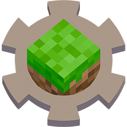

<p align="center"></p>

# ArdaBiomesEditor
A biome color mapping editor for Ardacraft and Polytone

## Installation

Download the latest release and unzip the archive. Run `ArdaBiomesEditor.exe` to start the application.

## Usage

- `File` → `Open Folder...` to load a [resource pack](https://github.com/ArdaCraft/ACRP). The resource pack needs to contain [polytone](https://github.com/MehVahdJukaar/polytone) definitions, see the [Polytone Sample Pack](https://github.com/MehVahdJukaar/polytone/tree/1.21.1/polytone_sample_pack) for a working example.

<p align="center"></p>

### Resource Tree

The left pane displays the resource tree of the loaded resource pack. The tree can be filtered using the dropdown.

The displayed resources can be one of the following types:
-  Directory : a folder
-  Modifier : a modifier json definition
-  Colormap : a colormap json definition (inlined or standalone)
-  Biome mapper : a biome id mapper (inlined or standalone)

### Colormap Editor

The colormap editor allows editing of colormaps and biome mappings.

#### Keybinds

> **Canvas Editor**
>
> | Shortcut            | Action              |
> |---------------------|---------------------|
> | `CTRL` + `Click`    | Select multiple     |
> | `CTRL` + `A`        | Select all          |
> | `CTRL` + `D`        | Deselect            |
> | `CTRL` + `I`        | Invert selection    |
> | `CTRL` + `H`        | Hide column         |
> | `ALT` + `H`         | Unhide all          |
>
> **Mouse navigation**
>
> | Shortcut                 | Action        |
> |--------------------------|---------------|
> | `CTRL` + `Scroll`        | Zoom in / out |
> | `Middle mouse click`     | Panning       |
>
> **Bottom toolbar**
>
> -  Fit all the columns into view
> -  Fit all the rows into view
> -  Display checkerboard (for transparency editing)
>
> **Sliders**
>
> - Double click on the thumb resets the slider to 0


#### Center panel

- When a **colormap** resource is selected, the editor displays the associated texture and its mappings (if defined in json).
- When a **biome** mapper resource is selected, the editor display each corresponding mapped biome from each colormap referencing this mapper.

#### Right panel

- The right panel displays the list of mappings (columns) of the colormap.
- When one or multiple mappings are selected, a Hue/Saturation/Brightness color picker is displayed to edit the selected mapping(s).

#### Bottom toolbar

- Allow zooming in / out of the colormap texture.
- Shows the current selection 
-  Displays a checker pattern (for transparency) behind the colormap texture.

## Packaging and release

This project uses jlink, jpackage and wix to create a Windows runtime image.

- Run `mvn clean package javafx:jlink` to generate a shaded jar and create a custom runtime image in the target directory.
- The shaded jar should be located at `target\dist\`
- The custom runtime image should be located at `target\image\`

A release build can be created with the following command from the project root:

```bash
jpackage --type app-image \
  --input target\dist \
  --main-jar ArdaBiomeEditor-<version>.jar \
  --runtime-image target\image \
  --icon src\main\resources\assets\icons\icon.ico \
  --name ArdaBiomesEditor \
  --dest target\release \ 
  --main-class com.duom.ardabiomeseditor.ArdaBiomesEditor
```

## License

This work is licensed under the CC-BY 4 License

[](https://creativecommons.org/licenses/by/4.0/)

### Third-Party Assets

This project includes icons licensed under the Apache License 2.0.

- [Material Design Icons](https://icon-sets.iconify.design/mdi/) by Pictogrammers
  - License: Apache License, Version 2.0
  - License text: [LICENSE](assets/icons/mdi/LICENSE)
- [Remix Icon icon set](https://icon-sets.iconify.design/ri/) by Remix Design
  - License: Apache License, Version 2.0
  - License text: [LICENSE](assets/icons/ri/LICENSE)
- [Tabler Icons](https://icon-sets.iconify.design/tabler/) by Paweł Kuna
  - License: MIT License
  - License text: [LICENSE](assets/icons/tabler/LICENSE)
